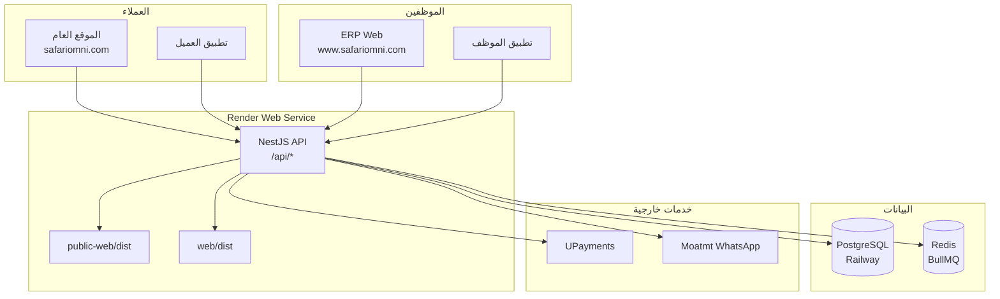

# Safari ERP / Safari Omni — دليل النظام الكامل

> **الإصدار:** 1.5.5  
> **المشروع:** `D:\Safari-ERP`  
> **الشركة:** مجموعة مصابغ سفاري السريعة — Safari Express Laundries Group  
> **المنتج الداخلي:** Safari Omni (سفاري أوميني)  
> **تاريخ التوثيق:** 2026-05-28

---

## 1. ملخص تنفيذي

**Safari ERP** هو نظام تشغيل متكامل لمجموعة مصابغ سفاري في الكويت. يغطي:

- **العمليات الميدانية:** طلبات، توزيع، سائقين، POS، تحصيل
- **المالية:** دفتر أستاذ، محفظة العملاء، تسويات، مديونيات، مدفوعات إلكترونية
- **الموارد البشرية:** حضور، إجازات، رواتب، سلف، عمولات
- **المخزون والمشتريات:** كتalog، حركات مخزون، أوامر شراء
- **الكول سنتر:** Customer 360، اشتراكات، تحصيل، طلبات الموقع
- **العملاء:** موقع عام، تطبيق موبايل، بوابة OTP، روابط دفع

النظام **monorepo** واحد: API مركزي + واجهة موظفين + موقع عام + تطبيقان موبايل.

---

## 2. هيكل المشروع

```
Safari-ERP/
├── src/                    # NestJS API (الخادم الرئيسي)
├── web/                    # واجهة الموظفين (React + Vite)
├── apps/
│   ├── public-web/         # الموقع العام للشركة
│   ├── employee-mobile/    # تطبيق الموظفين (Expo)
│   └── customer-mobile/    # تطبيق العملاء (Expo)
├── packages/
│   ├── shared-api/         # عقود TypeScript مشتركة
│   └── shared-ui/          # (محجوز للمستقبل)
├── prisma/                 # PostgreSQL schema + migrations + seed
├── docs/                   # دستور، معمارية، runbooks
├── deploy/                 # إعدادات الإنتاج والدومينات
├── scripts/                # نسخ احتياطي، reset، pre-deploy
├── test/                   # اختبارات E2E
├── Dockerfile              # بناء الإنتاج (API + SPAs)
└── docker-compose.yml      # Postgres محلي
```

---

## 3. التقنيات المستخدمة

| الطبقة | التقنية |
|--------|---------|
| **Backend** | NestJS 11, TypeScript, Prisma 7, PostgreSQL |
| **Auth** | JWT + Passport, bcrypt, refresh tokens دوّارة |
| **Jobs / Cache** | BullMQ + Redis (اختياري محلياً، مطلوب في الإنتاج) |
| **Realtime** | SSE عبر `safari-stream` |
| **Payments** | UPayments (روابط دفع + webhooks) |
| **WhatsApp** | Moatmt API |
| **Observability** | Sentry, OpenTelemetry, Prometheus (`/metrics`) |
| **Staff Web** | React 19, Vite 8, Tailwind 4, i18next (عربي/إنجليزي) |
| **Public Web** | React 19, Vite 8, Tailwind 4 |
| **Mobile** | Expo 54, Expo Router, React Native 0.81 |
| **CI** | GitHub Actions |
| **Hosting** | Render (التطبيق) + Railway (قاعدة البيانات) |

---

## 4. الأسطح والدومينات

| الجمهور | الرابط | ماذا يظهر |
|---------|--------|-----------|
| **العملاء** | `https://safariomni.com` | الموقع العام + `/api/*` |
| **الموظفين** | `https://www.safariomni.com/login` | نظام ERP |
| **تحويل** | `safariomni.com/login` | → `www.safariomni.com/login` |

### محلياً

| الخدمة | الأمر | الرابط |
|--------|-------|--------|
| API | `npm run dev` | `http://localhost:3000` |
| ERP | `npm run web:dev` | `http://localhost:5173/login` |
| الموقع العام | `npm run public-web:dev` | المنفذ 5180 |
| Postgres | `docker compose up -d` | `127.0.0.1:5432` |

**تسجيل دخول محلي (بعد seed):** `admin` / `admin`

---

## 5. الهوية البصرية (علامتان)

| الوجه | الاسم | الاستخدام |
|-------|-------|-----------|
| **للعملاء** | مجموعة مصابغ سفاري السريعة | فواتير، إيصالات، الموقع العام، تطبيق العميل |
| **للموظفين** | Safari Omni / سفاري أوميني | لوحة ERP، تسجيل الدخول، أدوات الإدارة |

| المكان | الشعار |
|--------|--------|
| ERP (موظفين) | SVG — `BrandLogo` + `brand-mark.svg` |
| الموقع العام | PNG — `apps/public-web/public/logo.png` |

**ملفات المصدر:**
- `web/src/lib/brand.ts`
- `apps/public-web/src/brand.ts`
- `src/common/constants/branding.ts`

---

## 6. الأدوار والصلاحيات

### أدوار النظام (`SafariRole`)

| الدور | الوصف | الصفحة الرئيسية |
|-------|-------|-----------------|
| `OWNER` | المالك | `/dashboard` |
| `GENERAL_MANAGER` | مدير عام (قراءة فقط للتعديلات) | `/dashboard` |
| `MANAGER` | مدير فرع | `/dashboard` + أدوات الفرع |
| `DRIVER` | سائق ميداني | `/pos` (واجهة جزيرة) |
| `WORKER` | عامل مخزن/تشغيل | حسب الصلاحيات |
| `CALL_CENTER` | موظف كول سنتر | `/cc/dashboard` |
| `CALL_CENTER_SUPERVISOR` | مسؤول الكول سنتر | `/cc-performance` |
| `FLEET_SUPERVISOR` | مسؤول السيارات | مصروفات المركبات |
| `ACCOUNTANT` | محاسب | `/accountant-dashboard` |
| `SUPERVISOR` | مشرف (عرض) | `/dashboard` |
| `VIEWER` | قراءة فقط | `/dashboard` |
| `CUSTOMER` | عميل B2C | `/my-customer-360` |

**مصدر الصلاحيات:**
- الواجهة: `web/src/modules/shared/auth/access-matrix.ts`
- الخادم: `@Roles()` + `PermissionsGuard` على الـ controllers

---

## 7. الوحدات والميزات الرئيسية

### 7.1 الطلبات والفواتير
- دورة حياة الطلب من الإنشاء حتى التسليم والدفع
- إنشاء سريع، POS، PDF، مشاركة برابط
- **Backend:** `src/orders/`, `src/pos/`, `src/invoice-audit/`
- **Frontend:** `web/src/pages/orders-page.tsx`, `DriverPOS.tsx`

### 7.2 التوزيع والسائقين
- تعيين مهام، GPS، فواتير معلّقة، عهدة نقدية
- **Backend:** `src/dispatch/`, `src/driver-oversight/`, `src/shifts/`
- **Mobile:** `apps/employee-mobile/app/(app)/(driver)/`

### 7.3 نقطة البيع (POS)
- طرق الدفع: نقد، KNET، رابط دفع، دين على الحساب، اشتراك
- POS فرع (MANAGER) + POS سائق (DRIVER)
- **Backend:** `src/pos/`, `src/laundry-price-list/`

### 7.4 الكول سنتر
- Customer 360، تحصيل، طلبات الموقع، Control Tower
- 12 نقطة CC مُقفلة (انظر `docs/DUSTUR_KAMIL.md`)
- **Backend:** `src/call-center/`, `src/collections-workflow/`
- **Frontend:** `web/src/modules/call-center/`

### 7.5 التحصيل والمديونيات
- فواتير غير مدفوعة، وعود بالدفع، أعمار الديون
- **Backend:** `src/finance/debt-visibility/`, `src/debt-transfers/`
- **Frontend:** `web/src/modules/collections/`

### 7.6 المالية والمحاسبة
- دفتر أستاذ مزدoj (General Ledger)
- محفظة العملاء (Customer Ledger)
- تسويات، قفل فترات، KPIs، read models
- **وثائق:** `docs/architecture/financial-core.md`, `docs/architecture/V20.4_ARCHITECTURE.md`

### 7.7 العهدة والنقد
- دورة حقيبة المدير، تسليم السائقين، تصنيف النقد
- **Backend:** `src/cash-monitor/`, `src/cash-intelligence/`, `src/manager-custody/`

### 7.8 المدفوعات
- UPayments: روابط hosted + callbacks
- **Backend:** `src/payments/`
- **وثائق:** `docs/architecture/payment-flows.md`

### 7.9 الاشتراكات
- خطط، محافظ مشتركين، تفعيل عبر `CustomerLedgerService`
- **Backend:** `src/subscription-plans/`, `src/subscribers/`

### 7.10 الموارد البشرية
- حضور، إجازات، سلف، رواتب، عمولات
- **Backend:** `src/attendance/`, `src/leaves/`, `src/payroll/`, `src/loans/`, `src/commissions/`
- **Routes:** `/attendance`, `/leaves`, `/loans`, `/payroll`, `/staff-hub`

### 7.11 المخزون
- كتalog، حركات، أوامر شراء، تنبيهات نقص
- **Backend:** `src/inventory/`, `src/purchase-orders/`, `src/serials/`

### 7.12 المصروفات
- مصروفات الفروع، الثابتة، مركبات (Fleet Supervisor)
- **Backend:** `src/expenses/`, `src/fixed-expenses/`, `src/vehicle-expenses/`

### 7.13 المالك والتقارير
- لوحة تنفيذية، إعدادات النظام، System Guardian
- **Backend:** `src/owner-dashboard/`, `src/system-settings/`, `src/reports/`

### 7.14 العملاء والبوابة العامة
- API عام: كتalog، طلبات، OTP، روابط دفع
- **Backend:** `src/public-api/`
- **Routes عامة:** `/public/invoice/:token`, `/feedback`, `/r/:orderId`

---

## 8. معمارية الـ API

### نقاط الدخول

| المسار | الغرض |
|--------|-------|
| `/api/*` | REST API |
| `/docs` | Swagger (Bearer auth) |
| `/health`, `/health/live`, `/health/ready` | فحص الصحة |
| `/metrics` | Prometheus |
| `/uploads` | ملفات مرفوعة |

### Auth API (`/api/auth/`)

| Method | المسار | الوصف |
|--------|-------|-------|
| POST | `/login` | تسجيل دخول الموظفين |
| POST | `/refresh-token` | تجديد JWT |
| POST | `/logout` | خروج |
| POST | `/change-password` | تغيير كلمة المرور |

### Public API (`/api/public/`)

| Method | المسار | الوصف |
|--------|-------|-------|
| GET | `/catalog` | قائمة الأسعار |
| POST | `/orders/request` | طلب خدمة من الموقع/الموبايل |
| POST | `/customer-auth/request-otp` | OTP واتساب |
| POST | `/customer-auth/verify-otp` | تحقق OTP |
| GET | `/customer-portal/me` | بيانات العميل |
| POST | `/customer-portal/payment-link` | رابط دفع |
| GET | `/employee/tasks` | مهام السائق (موبايل) |

### وحدات NestJS (68+ وحدة)

أهمها في `src/app.module.ts`:
Auth, Orders, Dispatch, Pos, Payments, Finance, CallCenter, CollectionsWorkflow, Customers, Subscribers, Inventory, Payroll, Attendance, Leaves, Loans, Commissions, OwnerDashboard, PublicApi, SafariStream, SystemGuardian, AuditLogs, Health, …

---

## 9. تدفق المصادقة

### موظفين (JWT)

```
1. POST /api/auth/login { username, password }
2. تحقق bcrypt + دور + ساعات العمل (للسائق/المدير)
3. إصدار access JWT (24h) + refresh token (7 أيام، دوّار)
4. الواجهة تحفظ في localStorage: safari_erp_token
5. كل طلب محمي: Bearer header + RolesGuard + PermissionsGuard
```

### عملاء (OTP)

```
1. POST /api/public/customer-auth/request-otp
2. POST /api/public/customer-auth/verify-otp
3. JWT بـ purpose=CUSTOMER_PORTAL + linkedCustomerId
```

### Guards عالمية

1. ThrottlerGuard  
2. JwtAuthGuard  
3. PasswordChangeScopeGuard  
4. GeneralManagerReadOnlyGuard  
5. RolesGuard  
6. PermissionsGuard  

---

## 10. تطبيقات الموبايل

### تطبيق الموظفين (`apps/employee-mobile/`)

| الدور | الشاشات |
|-------|---------|
| DRIVER | مهام، مسح، POS، عهدة، GPS |
| CALL_CENTER | بحث، تحصيل، طلبات الموقع |
| MANAGER | ملخص نقد، مراقبة سائقين، اعتماد عهدة |

- **Auth:** نفس JWT (`POST /api/auth/login`)
- **Config:** `EXPO_PUBLIC_API_URL` → `https://safariomni.com/api`
- **تشغيل:** `npm run employee-mobile:start`

### تطبيق العملاء (`apps/customer-mobile/`)

| Tab | الوظيفة |
|-----|---------|
| Home | كتalog |
| Cart | سلة → `POST /api/public/orders/request` |
| Orders | تتبع الطلبات |
| Account | OTP، فواتير، دفع |

- **Auth:** OTP واتساب
- **Payments:** UPayments links
- **Build:** EAS (`eas.json`)

---

## 11. الموقع العام

**المسار:** `apps/public-web/`

| الصفحة | المحتوى |
|--------|---------|
| `/` | الرئيسية |
| `/about` | عن المجموعة |
| `/individuals` | خدمات الأفراد |
| `/companies` | خدمات الشركات |
| `/corporate-government.html` | ملف الجهات والعقود |
| `/quality` | الجودة |
| `/branches` | الفروع |

- **الشعار:** `logo.png`
- **زر دخول الموظفين:** → `https://www.safariomni.com/login`
- **الأسعار:** من API عام (`GET /api/public/catalog`)
- **البناء:** `npm run public-web:build`

---

## 12. أوامر التشغيل الأساسية

### التطوير المحلي

```powershell
# 1. قاعدة البيانات
docker compose up -d

# 2. API (watch mode)
npm run dev

# 3. واجهة الموظفين (terminal منفصل)
npm run web:dev

# 4. الموقع العام (اختياري)
npm run public-web:dev

# 5. موبايل (استخدم IP الشبكة، ليس localhost)
npm run employee-mobile:start
npm run customer-mobile:start
```

### قاعدة البيانات

```powershell
npm run prisma:generate    # توليد Prisma client
npm run db:seed            # بذر الأدوار والأسعار
npm run db:check-drift     # فحص migrations
npm run db:backup-desktop  # نسخة احتياطية على سطح المكتب
```

### ⚠️ أوامر خطرة (تحتاج تأكيد صريح)

```powershell
npm run db:reset-invoices          # حذف الفواتير
npm run db:reset-money             # حذف الفواتير + المال
npm run db:reset-local             # مسح كامل محلي
npm run financial:reset -- --apply # إعادة ضبط مالي كامل
```

### البناء والاختبار

```powershell
npm run build              # بناء API
npm run web:build          # بناء ERP
npm run public-web:build   # بناء الموقع العام
npm test                   # unit tests
npm run test:integration   # integration tests
npm run test:e2e           # E2E
npm run check              # فحص أمان pre-commit
```

---

## 13. النشر والإنتاج

### Pipeline

```
git push main → Render auto-deploy
Dockerfile يبني: API + web/dist + apps/public-web/dist
CMD: pre-deploy → prisma migrate deploy → node dist/main.js
```

### متغيرات بيئة مهمة

| المتغير | الغرض |
|---------|-------|
| `DATABASE_URL` | PostgreSQL (Railway) |
| `JWT_SECRET` | توقيع JWT |
| `REDIS_URL` | BullMQ (مطلوب prod) |
| `PAYMENTS_*` | UPayments |
| `MOATMT_*` | WhatsApp |
| `SENTRY_DSN` | مراقبة الأخطاء |
| `OPERATING_HOURS_LOCK_ENABLED` | قفل خارج ساعات العمل |

**قوالب:** `deploy/render-production.env`, `.env.example`

---

## 14. مخطط معماري مبسّط



---

## 15. دورة حياة الطلب (مبسّطة)

```
طلب جديد (POS / CC / موقع / موبايل)
    ↓
إنشاء Order + Invoice
    ↓
توزيع (Dispatch) → سائق
    ↓
تسليم + تحصيل (CASH / KNET / LINK / DEBT / SUBSCRIPTION)
    ↓
تسوية CustomerLedger + GeneralLedger
    ↓
إشعار عميل (WhatsApp) + تقارير
```

---

## 16. الوثائق المرجعية داخل المشروع

### ابدأ من هنا

| الملف | المحتوى |
|-------|---------|
| `docs/DUSTUR_KAMIL.md` | **الدستور الكامل** — قواعد النظام |
| `docs/DUSTUR_SAIQ_V1.md` | دستور السائق |
| `docs/architecture/financial-core.md` | النواة المالية |
| `docs/architecture/module-ownership.md` | ملكية الوحدات |
| `deploy/public-web-domains.md` | الدومينات والتوجيه |

### Runbooks

| الملف | المحتوى |
|-------|---------|
| `docs/architecture/operational-runbooks/production-deployment.md` | النشر |
| `docs/architecture/operational-runbooks/rollback-procedure.md` | التراجع |
| `docs/architecture/operational-runbooks/incident-response.md` | الحوادث |
| `docs/BACKUP.md` | النسخ الاحتياطي |
| `docs/safe-deployment.md` | نشر آمن |
| `docs/OBSERVABILITY.md` | المراقبة |

### قرارات التكامل

| الملف | المحتوى |
|-------|---------|
| `docs/web-mobile-integration-decisions.md` | قرارات الموبايل والعلامة |
| `docs/architecture/payment-flows.md` | تدفقات الدفع |
| `docs/architecture/invariants.md` | ثوابت الأمان |

---

## 17. قواعد ذهبية (لا تُكسر)

1. **الصلاحيات:** `access-matrix.ts` + `@Roles()` فقط — لا قرارات صلاحية خارجها
2. **المال:** أي تعديل دين/رصيد داخل Prisma transaction يحدّث `CustomerWallet` + `TransactionHistory` + `GeneralLedgerEntry` معاً
3. **الاشتراكات:** التفعيل عبر `CustomerLedgerService.activateSubscriptionPlan` فقط
4. **الكول سنتر:** الميزات الجديدة ترتبط بـ `/subscribers` أو `/customers` أو `/collections`
5. **صفحة المالك:** مجمّدة — تحديث يدوي
6. **API محلي:** استخدم `npm run dev` (watch) — **ليس** `npm run start` (dist قديم)
7. **تصفير الإنتاج:** يحتاج flags صريحة — لا يحدث تلقائياً

---

## 18. فهرس ملفات مهمة

| الموضوع | المسار |
|---------|--------|
| Package + scripts | `package.json` |
| Nest root module | `src/app.module.ts` |
| API bootstrap | `src/main.ts` |
| DB schema | `prisma/schema.prisma` |
| Staff routes | `web/src/App.tsx` |
| Access matrix | `web/src/modules/shared/auth/access-matrix.ts` |
| Brand (ERP) | `web/src/lib/brand.ts` |
| Brand (public) | `apps/public-web/src/brand.ts` |
| Domain routing | `src/bootstrap/website-host-routing.ts` |
| Production env | `deploy/render-production.env` |
| Dockerfile | `Dockerfile` |
| Local Postgres | `docker-compose.yml` |

---

## 19. معلومات التواصل (الشركة)

| | |
|---|---|
| **الاسم العربي** | مجموعة مصابغ سفاري السريعة |
| **الاسم الإنجليزي** | Safari Express Laundries Group |
| **الهاتف** | 22200299 |
| **البريد** | info@safariomni.com |
| **الفروع** | الجهراء، الرقعي، صباح السالم، الفروانية |

---

*هذا الملف ملخص تشغيلي — للتفاصيل التقنية العميقة راجع `docs/DUSTUR_KAMIL.md` وملفات `docs/architecture/`.*
